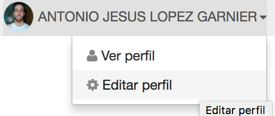
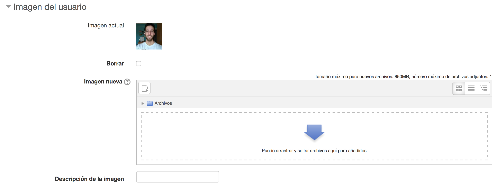

# Capítulo 1: Información Personal.

## Introducción

En este capítulo veremos los pasos a desarrollar para cambiar la foto de perfil
de nuestro campus virtual así como un ejemplo de pagina web personal desarrollada
en [GitHub](https://github.com) que veremos con más detalle en capítulos siguientes.

## Establecer una foto de perfil en el campus virtual.

* Entramos en el [Campus Virtual](https://campusvirtual.ull.es).

* Accedemos con nuestro usuario y contraseña.

* Vamos a nuestro nombre y seleccionamos editar perfil como se muestra en la imagen:

   

* Seleccionamos editar perfil:

   

* Elegimos nuestra imagen y actualizamos el perfil:

   

Con esto ya quedaría actualizada la foto en nuestro campus virtual.

## Pagina personal alojada en GitHub

* Creamos un repositorio en nuestra cuenta de GitHub en la que el nombre del repositorio
coincida con el nombre de usuario. Ejemplo: **nombre_usuario.github.io**.

* Una vez creado el repositorio habría que crear una rama **"gh-pages"** y empujar desde
ésta todos los ficheros .html al repositorio.

* Ahora podríamos acceder a la pagina web, escribiendo **"nombre_usuario.github.io"**
en la barra de direcciones.

[Siguiente capítulo](../capitulo2/README.md)
