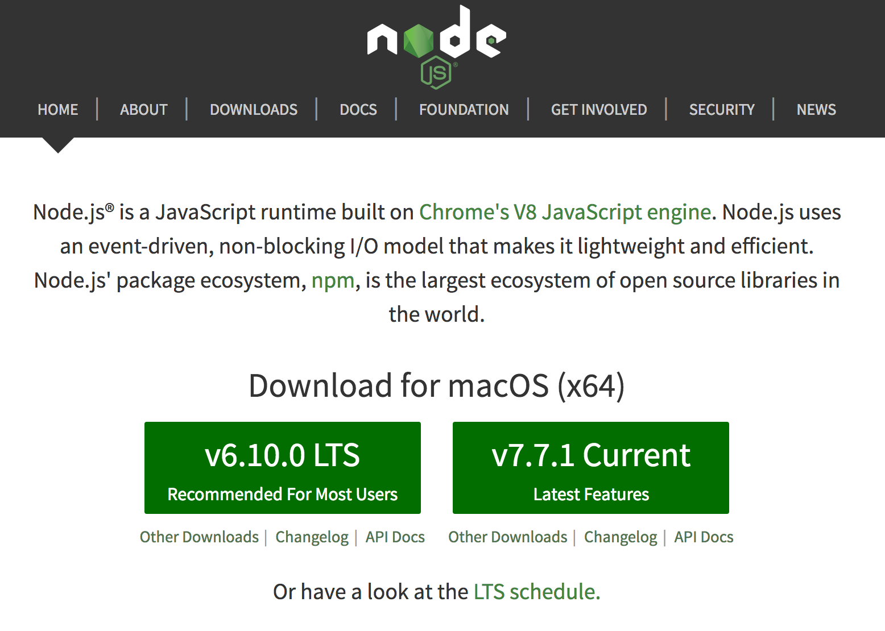

# Capítulo 2: NodeJS

## Introducción

**Node.js** es un entorno de ejecución para JavaScript construido con el motor de
JavaScript V8 de Chrome. Node.js usa un modelo de operaciones E/S sin bloqueo y
orientado a eventos, que lo hace liviano y eficiente. El ecosistema de paquetes
de Node.js, **npm**, es el ecosistema mas grande de librerías de código abierto en
el mundo.

Node.js esta disponible para varias plataformas, en este tutorial nos vamos a
centrar en la instalación de Node.js para Mac.

## Instalación

Para la instalación en Mac los pasos a seguir son muy sencillos:
 * Accedemos a la pagina web de Node.js.
 * [Pagina web Node.js](https://nodejs.org/es/).
   

 * Descargamos la versión recomendada de **Node.js**.
 * Durante la instalación solo tenemos que seguir los pasos indicados al abrir
 el archivo descargado.

 [Siguiente capítulo](../capitulo3/README.md)
