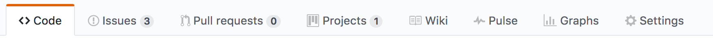

# Capítulo 3: GitHub

## ¿Qué es GitHub?

GitHub es una plataforma de desarrollo colaborativo de software para alojar proyectos
utilizando el sistema de control de versiones Git. El código se almacena de forma
pública, aunque también se puede hacer de forma privada, creando una cuenta de pago.

## ¿Para que sirve?

GitHub aloja tu repositorio de código y te brinda herramientas muy útiles para el
trabajo en equipo, dentro de un proyecto.

Además de eso, puedes contribuir a mejorar el software de los demás. Para poder
alcanzar esta meta, GitHub provee de funcionalidades para hacer un fork y solicitar pulls.

Realizar un fork es simplemente clonar un repositorio ajeno (genera una copia en tu cuenta),
para eliminar algún bug o modificar cosas de él. Una vez realizadas tus modificaciones puedes
enviar un pull al dueño del proyecto. Éste podrá analizar los cambios que has realizado
fácilmente, y si considera interesante tu contribución, adjuntarlo con el repositorio original.

## ¿Qué herramientas proporciona?

* Una wiki para el mantenimiento de las distintas versiones de las páginas.

* Un sistema de seguimiento de problemas que permiten a los miembros de tu equipo
detallar un problema con tu software o una sugerencia que deseen hacer.

* Una herramienta de revisión de código, donde se pueden añadir anotaciones en
cualquier punto de un fichero y debatir sobre determinados cambios realizados en un
commit específico.

* Un visor de ramas donde se pueden comparar los progresos realizados en las distintas
ramas de nuestro repositorio.

## Primeros pasos con GitHub

Aquí dejo un [enlace](https://styde.net/primeros-pasos-con-git-y-github/) sobre
una página donde explica los primeros pasos de forma detallada.

[Siguiente capítulo](../capitulo4/README.md)
