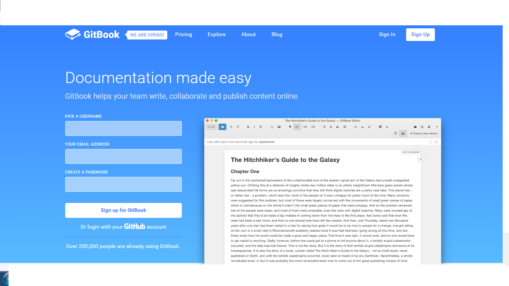
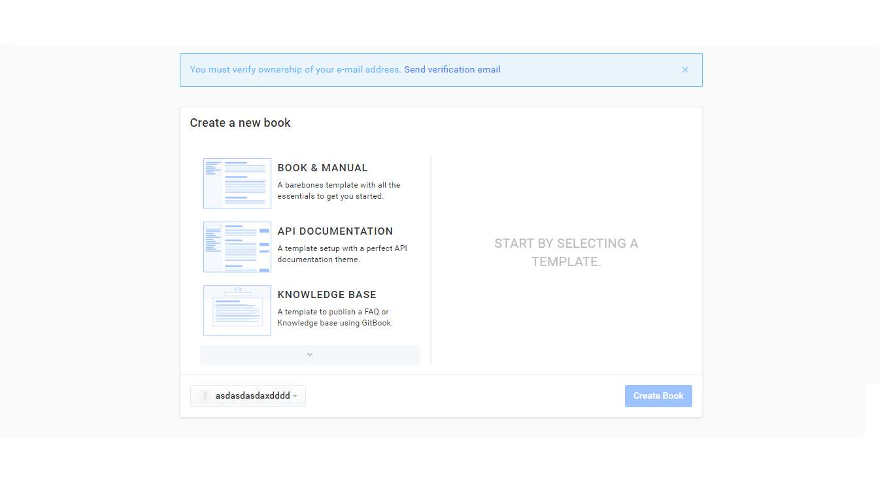

# Capítulo 5: GitBook

## ¿Qué es GitBook?

es una excelente herramienta para crear documentación de proyectos y libros técnicos usando Markdown y Git/Github.
Permite incluir ejemplos y ejercicios interactivos (de momento, soporta solamente JavaScript) para posteriormente
publicarlos de forma online via Github o cualquier otro hosting web.

## ¿Cómo Registrarse?

1. Vamos a la página de [GitBook](https://www.gitbook.com/)
2. En la pagina Directamente nos pide los datos de usuario y si presionamos el boton sing up nos registraremos.
    
3. Ahora nos dirigue a una pagina en la que nos da la opción de seguir el manual, nos enseña la api de y las base de conocimientos.
    
4. Seleccionamos una, nos pedirá el nombre y seleccionamos Create Book, con esto ya tendríamos creado nuestro Gitbook.

 [Siguiente capítulo](../capitulo6/README.md)
