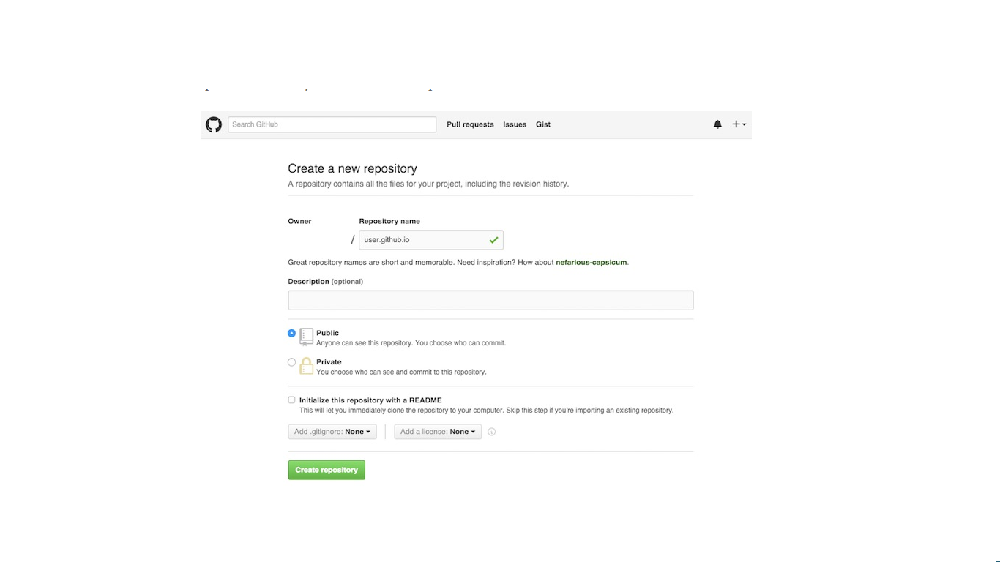

# Capítulo 6: GitHub Pages

## Introducción

GitHub Pages es una forma de alojar nuestros proyectos en una página web,
sin necesidad de tener conocimientos en servidores. De hecho, es algo muy sencillo
y que no te tomará más de 5 minutos configurar. En este tutorial se mostrará cómo hacerlo.

## ¿Como se Hace?

1. Primero vamos a Crear un Nuevo repositori en GitHub para Nuestra pagina.

2. A partir de aquí es igual que un repositorio normal solo tenemos que enlazarlo y hacer nuestros commit
como normalmente lo hariamos.
**$ git clone** https://github.com/nombreDeUsuario/nombreDeUsuario.github.io

3. O con una vinculacion remota
**$ git remote add origin** https://github.com/nombreDeUsuario/nombreDeUsuario.github.io

4. Y listo nuestra git page podremos verla en este link que sirve para cualquier usuario
**http://nombreDeUsuario.github.io.**

5. Pero esto no es todo tambien podemos hacer git pages para nuestros proyectos , Basta con tan solo
crear una nueva rama para la gh pages por ejemplo.
**$ git branch gh-pages**

6. Ahora hacemos un push de este repositorio ..
**$ git push origin gh-pages**

7. y listo nuestra git page se vera en el enlace por ejemplo:
**http://nombreDeUsuario.github.io/repositorio**
